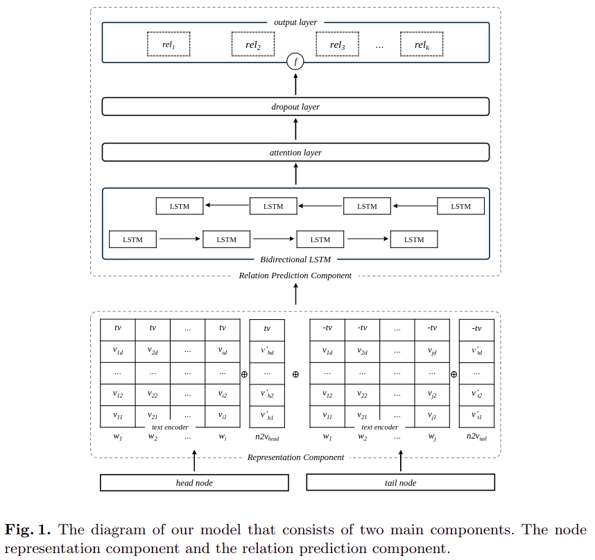

# Knowledge Graph Completion using Structural and Textual Embeddings

## Abstract
Knowledge Graphs (KGs) are thoroughly used in artificial intelligence applications such as question-answering and recommendation systems. However, KGs are known to be incomplete. While most of the literature work focused on predicting a missing node for a given relation and an existing node, KGs can be enhanced by exploring relations between existing nodes. Such an approach is called relation prediction. We propose a relation prediction model that utilizes both KG textual and structural information. We combine walks-based embeddings with language model embeddings to represent nodes. Our model presents competitive results compared to the achievements in the relation prediction task on a widely used dataset.
Following are the steps to reproduce the results in our model.



## Requirements
- Python 3.9
- PtyTorch 2.1
- Networkx 2.8
- TQDM 4

**Install Requirements**
```
python3 -m pip install torch==2.1*
python3 -m pip install networkx==2.8*
python3 -m pip install tqdm
```

## Pre-trained Language Model
* Our model achieves its best performance using **Glove word representation** (6B tokens, 400K vocab, uncased, 300d vectors)

[Download Glove](https://nlp.stanford.edu/projects/glove/)

## Datasets

## Run Training
